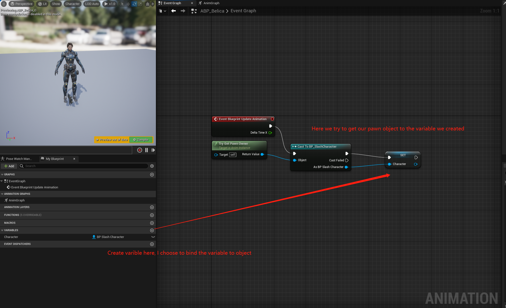

# Introduction

I am learning UE5 with C++. Here is my notes about some Animation in UE5.

# Outlines

[Basic Terms]()

[Add Variables To Event Graph]()

# Content

## Basic Term{#BasicTerm}

1. `AnimGraph`: Deal with poses
2. `EventGraph`: Flow of execution of logic
3. `StateMachine`: It is a node in `AnimGraph` where we can control how to blend our different movement

## Add Variables{#AddVariables}

